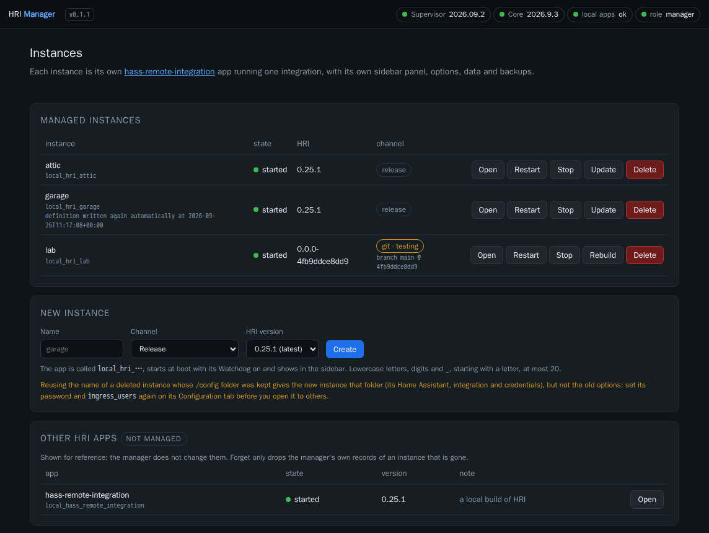
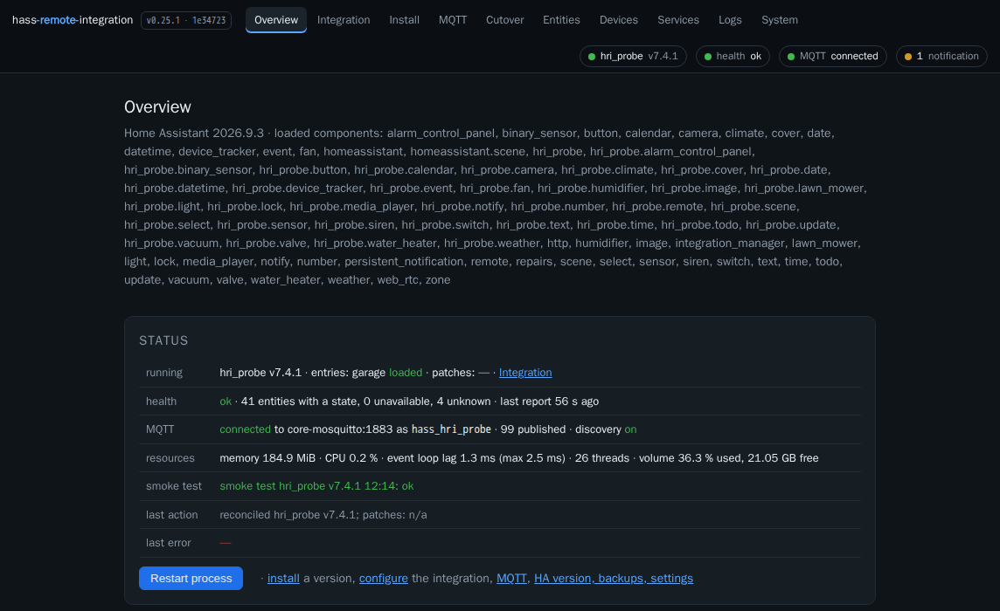
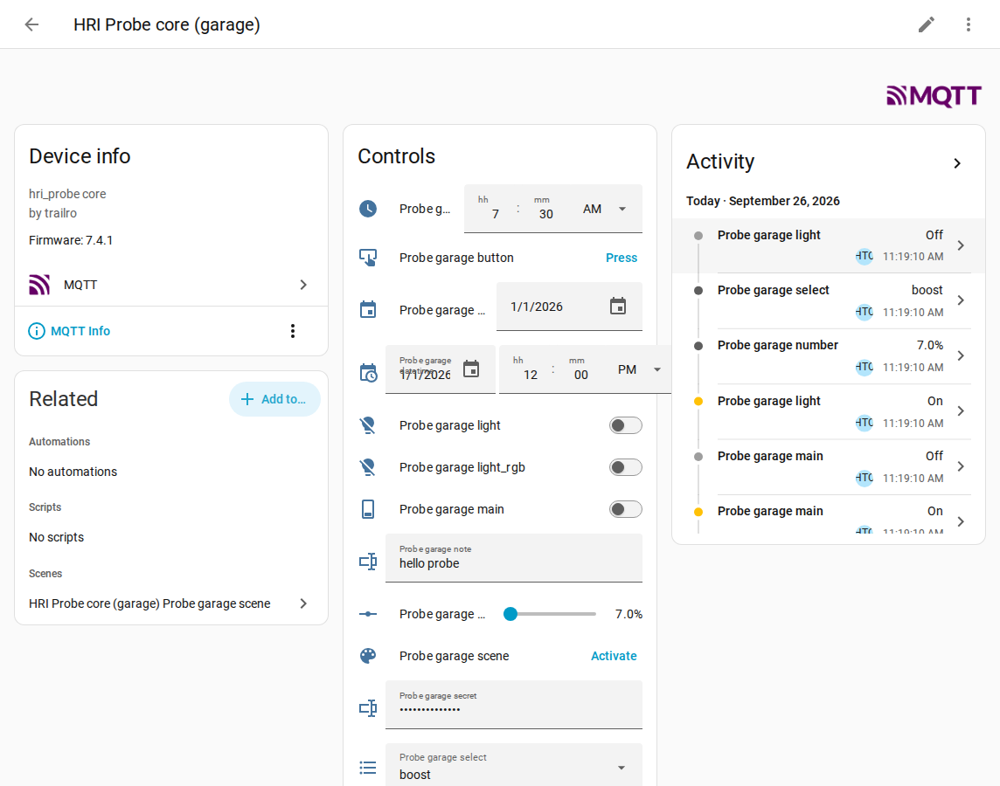
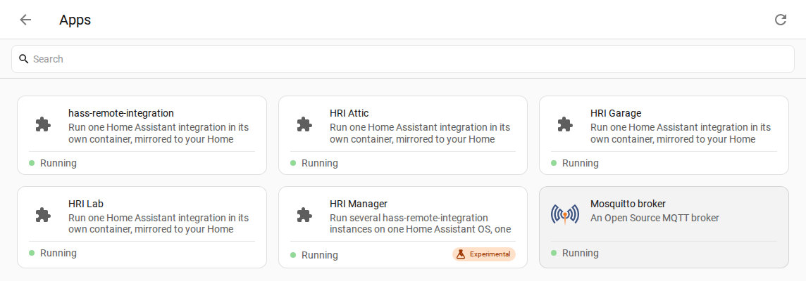
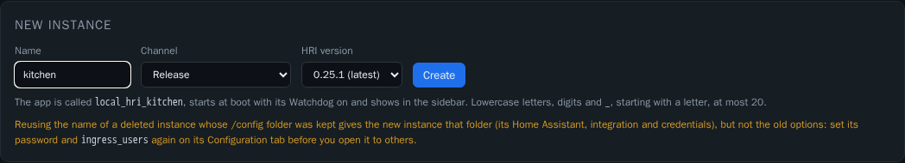
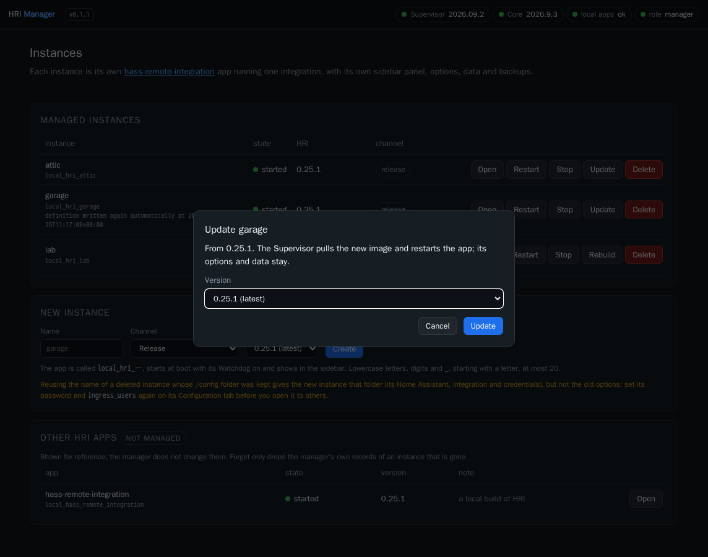
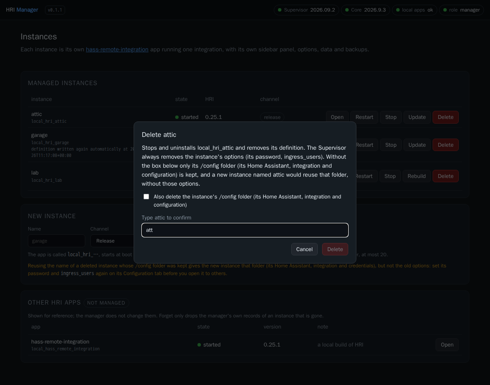
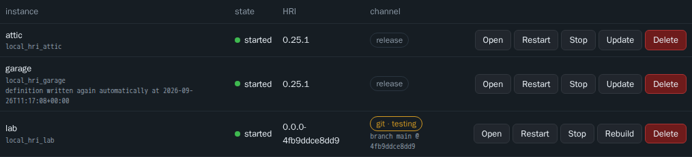

# HRI Manager

A Home Assistant app that runs several instances of
[hass-remote-integration](https://github.com/trailro/hass-remote-integration) (HRI) on one **Home Assistant OS**:
it creates, updates and removes them as local apps, one integration each.

HRI runs one Home Assistant integration in its own container and mirrors it to your Home Assistant over MQTT. On
Home Assistant OS it is an app with a single slug, so one install gives you one HRI. HRI Manager writes a copy of
HRI's own app definition for every instance you ask for, under its own slug (`local_hri_<name>`), and drives the
Supervisor to install, configure, start, update and remove it. Each instance is then an ordinary app: its own
sidebar panel, **Configuration** tab, data folder, logs and backups.

HRI itself is unchanged and stays the source of truth: the manager takes each instance's definition from the HRI
release you choose. On a plain Docker install you do not need this: run one HRI container per integration.

**Status: 0.1.2, experimental.** Home Assistant OS only (the Supervisor's local apps folder is required).

## What it looks like

The manager's page, with three instances: two of HRI releases and one git build.



Each instance is HRI's own app, with HRI's page as its sidebar panel:



and its integration's devices mirrored into Home Assistant over MQTT:



## Requirements

- Home Assistant OS with Supervisor **2026.07.1 or newer** (the `local_apps` folder mapping), Core 2025.10 or newer
  (HRI's own floor).
- HRI **0.25.0 or newer** for instances: the first HRI release that runs as an app with a sidebar panel.
- Internet access to GitHub (the release list and the source of the release you install) and to ghcr.io (the
  manager's and HRI's images, pulled by the Supervisor).

## Install

1. **Settings > Apps > App Store**, menu **⋮ > Repositories**, add
   `https://github.com/trailro/hass-remote-integration-manager`.
2. Install **HRI Manager**. The Supervisor pulls its image, `ghcr.io/trailro/hass-remote-integration-manager`
   (amd64 and aarch64), so the manager's backups do not hold a locally built image (0.1.0 was built on your machine,
   and its backups carried that image as `image.tar`).
3. On its **Info** tab, turn on **Show in sidebar** (the Supervisor leaves it off for a newly installed app, so
   there is no sidebar entry until you do), then **Start** it.
4. Open **HRI Manager** in the sidebar (or **Open web UI** on its Info tab). It is for Home Assistant
   administrators only (see [Security model](#security-model)).

The manager and each instance it creates are apps in **Settings > Apps**:



## Creating an instance

Under **New instance**, give a name and pick a release:



- the name: lowercase letters, digits and `_`, starting with a letter, at most 20 characters. It becomes the app
  `local_hri_<name>`, shown as *HRI &lt;Name&gt;*, with the sidebar panel *HRI &lt;name&gt;*. It must not be the
  slug of any installed app, nor give the host name of one (the Supervisor writes `_` as `-` in host names, so
  `local_hri_a-b` takes `a_b`); `manager` and a few other words are reserved;
- the release: HRI releases from 0.25.0 on, newest first; pre-releases are marked.

The manager then, as a job whose log the page shows:

1. downloads that release's source from GitHub and takes its `app/` folder (config, docs, translations);
2. records the instance in its registry (`/data/instances.json`) and writes the instance's definition to
   `hri_<name>/` in the local apps folder, stamped for this instance (below), with a marker file
   `.hri-manager.json`; a copy of the definition goes to its own `/data/definitions/<name>/` (see
   [Backups](#backups));
3. reloads the Supervisor's store and waits for `local_hri_<name>` to appear, and checks that the store's definition
   is the one it wrote (see [Security model](#security-model));
4. installs it (the Supervisor pulls HRI's image), checks the installed app the same way, turns on **Start on boot**,
   the **Watchdog** and **Show in sidebar**, and starts it.

If a step fails, what was done is undone: the app is uninstalled (its `/config` folder kept), the definition removed
and the store reloaded. The same when the manager itself is stopped midway (for at most 8 seconds, within the
Supervisor's stop timeout). Three cases are left for you to finish, and the page says which:

- the Supervisor went on installing after the manager stopped waiting (the manager was stopped, or its install call
  got no clean answer: a timeout, a lost connection, a server error): the app is listed as **install interrupted**,
  with **Repair** (then **Finish setup** or **Delete**). Until it shows up, the manager keeps its registry entry, and
  **Forget** is refused for an hour after the interruption;
- the manager stopped after the install but before the options and the start: the instance offers **Finish setup**,
  which turns on start at boot, the Watchdog and the panel, and starts it (the manager's log names such instances when
  it starts);
- a definition without its app (restored alone) offers **Install**.

If an instance of the same name was deleted before with its `/config` folder kept, the new one reuses that folder
(its Home Assistant, integration and credentials) but not the old options: set its password and `ingress_users` again.

The first start of an instance installs Home Assistant inside it and takes a few minutes; open its panel to follow
it, then set it up as the [HRI documentation](https://github.com/trailro/hass-remote-integration) says. Options
(password, `ingress_users`, Debian packages, ...) are on the instance's own **Configuration** tab.

### One integration per instance

Each instance runs **one** integration, as HRI does: for a second integration, create a second instance. Two
instances running the **same** integration cannot share an MQTT broker: HRI names everything it publishes after the
integration's domain (base topic and client id `hass_<domain>`, not a setting), so the second would take the first's
broker connection and clear its retained data. Give the instances different integrations. For two config entries of
one integration, put both in one instance (as HRI's README says), or give each instance its own broker. Base topics
per instance would lift this; they are a possible future HRI feature, not something the manager can set.

### What is stamped

Only what makes the copy a separate app; everything else is HRI's, as released:

| Key | Instance `garage` |
|---|---|
| `slug` | `hri_garage` (the Supervisor calls it `local_hri_garage`) |
| `name` / `panel_title` | `HRI Garage` / `HRI garage` |
| `version` | the release's own, `0.25.0` (at a release tag HRI's `app/config.yaml` still names the previous version) |
| `ports` | `8087/tcp: null`: no port published. The panel works through ingress; map a port on the instance's **Network** tab if you want one |
| `backup_exclude` | `*_hass_remote_integration/…` becomes `*_hri_garage/…`, so the instance's backups leave out its installed Home Assistant (about 800 MB) as HRI's do |
| `webui` | dropped |
| `host_dbus` | `true`, only for an instance created (or updated) with **Bluetooth**, below |

Before stamping, the manager checks HRI's template against the keys it knows from HRI's own app (`hrimgr/stamp.py`,
`TEMPLATE_KEYS`) and a vetted range for each: `map` only the instance's own `app_config`, `image` only HRI's, `url`
only HRI's repository, option types without `device`, and so on. A template with any other key (`hassio_role`,
`full_access`, `docker_api`, `privileged`, `host_network`, `devices`, `apparmor`, `environment`...) or a value
outside its range is refused, on both channels, with "HRI's app definition has &lt;key&gt;, which this manager version
does not accept; update the manager". `uart: true` is kept: HRI uses it for serial sticks.

### Bluetooth

An integration that talks to Bluetooth devices needs the host's Bluetooth adapter. In an app that adapter is reached
through BlueZ, the host's Bluetooth service, over the host's D-Bus, which the Supervisor gives an app with
`host_dbus: true`. HRI's published app does not ask for it, and neither does an instance unless you tick
**Bluetooth (access to the host's D-Bus)** when you create it. The manager then adds `host_dbus: true` to that
instance's definition and records the choice in its registry. HRI's template can never add it: `host_dbus` is not one
of the keys the manager accepts from it. The instance's row shows a **Bluetooth** badge.

- **What it enables:** the integration in that instance can scan for and connect to Bluetooth devices through the
  host's adapters, as Home Assistant's own Bluetooth integration does on the host.
- **Security:** D-Bus is a powerful interface. It reaches not just BlueZ but many of the host's system services (as
  far as their own D-Bus policies allow), so an instance with it can do much more on the host than one without. Turn it
  on only for an integration that needs Bluetooth, and only with code you trust.
- **Home Assistant keeps the adapter.** BlueZ serves several clients at once: Home Assistant Core goes on using the
  same adapter while the instance scans and connects through it. An adapter has a limited number of connection
  slots, which they share.
- **No adapter recovery in the instance.** Home Assistant's features that reset or recover a stuck adapter need raw
  HCI sockets (host network and extra capabilities), which an instance does not get. Home Assistant Core on the host
  still has them for its own use of the adapter.
- **Changing it later** is part of **Update** or **Rebuild**: their dialogs have the same box, and the change is
  applied with the new version. The Supervisor applies an installed app's definition only when the app's version
  changes (it refuses an update to the same version), so a change without a newer release or a new commit is refused
  with that reason. To change it at once, **Delete** the instance keeping its `/config` folder and create it again
  with the same name and the other choice (set its options again, see [Deleting](#deleting)).

The manager checks around every install and update that the Supervisor installed `host_dbus` exactly as the registry
says (see [Security model](#security-model)).

### Git channel (testing)

**Git branch or tag (testing)** builds HRI from a branch or a tag of
[trailro/hass-remote-integration](https://github.com/trailro/hass-remote-integration) instead of a release: for
trying a fix before it is released. **A git build runs that branch's code, and builds its Dockerfile, on this
machine: use it only for testing, and only with a branch or tag you trust.** Only branches and tags of HRI's own
repository are accepted, by their short name (`main`, `fix/something`, `v0.26.0b1`): never a commit, a pull request
(`pull/…`: anyone can open one) or a `refs/…` path. The manager checks with GitHub's API that the branch or tag
exists in HRI's repository before it downloads anything, downloads it by its full name (`refs/heads/…` or
`refs/tags/…`), and records the commit it got.

The manager downloads that source tree into the instance's folder, puts HRI's app definition at its root without
`image:` (so the Supervisor builds the folder's Dockerfile on your machine, which takes several minutes), removes
every other file the Supervisor's store would read as an app (by its own rule: `config.*` ending in `.yaml`, `.yml`
or `.json`, such as `docs/config.example.yaml`, outside dot folders and `rootfs/`) and nothing else, and gives it the
version `0.0.0-<first 12 hex digits of the commit>`. A tree with `apparmor.txt`, `build.yaml/yml/json` or a
`Dockerfile.<anything>` at its root is refused: the Supervisor would use them to confine or build the app instead of
HRI's Dockerfile. HRI's page shows the commit as its build. **Rebuild** downloads the branch or tag again and
rebuilds when its commit changed. Not for production.

## Updating

**Update** on an instance offers the releases at or above its version (the newest stable preselected; the page marks
an instance for which a newer release exists). The manager writes the new release's definition, keeping the previous
one aside, and asks the Supervisor to update the app: it pulls the new image and restarts the app with the same
options and data. If the update fails, or the manager is stopped midway, the previous definition is put back; if the
manager is killed midway (no time to put it back), its next start does it: the registry marks an update in progress
before the swap, and a definition in place that the registry never recorded goes, the previous one comes back. When
only the manager's own records could not be written after a successful update, the job says so as a warning, and the
next start records it. The manager does not downgrade.



The Supervisor's own **Update** button on the instance's app page appears only while the manager is updating it:
updates go through the manager, which is what moves the definition.

A release instance records the commit its release tag named. When the manager downloads the same tag again (a
Repair, or rewriting the definition) and the tag names another commit, it refuses and flags the instance "tag
moved": a release tag is not supposed to move.

A newer manager may stamp definitions differently. Each definition records the manager's stamping version, and
**Update** at the same HRI version rewrites a definition stamped by an older manager. The Supervisor applies an
installed app's definition only when the app's version changes (it refuses an update to the same version), so the new
stamping reaches the running instance at its next HRI update, or, for a git instance, its next rebuild of a new
commit. The manager does not force a rebuild for it.

HRI Manager itself is updated from the App Store like any app (an app cannot update itself).

## Deleting

**Delete** stops and uninstalls the instance and removes its definition; it always needs the instance's name typed.
What goes and what stays:



- the instance's **options** (its password, `ingress_users`, Debian packages...) are always removed: the Supervisor
  drops them with the app, whether or not you keep its data;
- its **`/config` folder** (`app_configs/local_hri_<name>` on the host: its Home Assistant, integration, credentials
  and configuration) is kept unless you tick **Also delete the instance's /config folder**;
- a new instance with the same name **reuses that `/config` folder**, but starts without the old options: set its
  password and `ingress_users` again before anyone else can open it.

## Backups

Each instance is an app, so Home Assistant backups include it like any other app: its `/config` folder, minus what
HRI's `backup_exclude` leaves out (stamped for the instance), and its options.

The instance's **definition** (`hri_<name>/` in the local apps folder) is another matter. On current Supervisors a full
backup **leaves the local apps folder out**: the backup still names the folder `addons/local`, while the Supervisor
has moved it to `apps/local` (an upstream issue of the Supervisor, not of this app). So:

- **After a full restore**, instances come back **detached**: installed and running, but without a definition, so they
  cannot be updated. The manager **writes their definitions again by itself**, whether or not anyone opens its page:
  it checks when it starts and then every 5 minutes (and whenever its page lists the instances). The Supervisor
  restores the apps one after another, usually the manager first, so each instance is repaired at the first check
  after its own restore: within about 5 minutes, or at once when the page is open. Every instance of its registry
  that is installed, detached and without its folder gets a repair job, run by "automatic repair", written to the
  manager's log, and shown on the instance's row. If one fails (GitHub unreachable, say), the row says why and when the next try is, and offers
  **Repair**; each further failure doubles the wait (5 minutes, 10, 20, ... at most a day), and only the first
  failure is a warning in the log. A repair that finds the instance **needs attention** (below) is not tried again:
  the log and the row say why and what you can do, with no next try. Apps that are not in the registry are never
  touched.

  
- **After a partial restore of an instance without the local apps folder**: the same.
- The manager's own **registry** of the instances it created (`/data/instances.json`: each instance's channel, branch
  or tag, commit and id) and a **copy of each definition** (`/data/definitions/<name>/`) are in the manager's
  `/data`, which **is** in the manager's own backup. Restore the manager with the instances and Repair works from
  them:
  - a release instance: its whole definition is in the copy (the stamped `config.yaml`, HRI's `DOCS.md`,
    `CHANGELOG.md` and translations; a few kilobytes), so Repair needs nothing from GitHub;
  - a git instance: the copy holds its stamped `config.yaml` and the commit it was built from, not the source tree
    (that would be megabytes); Repair downloads the source of that commit again, so the definition matches the
    installed app and nothing needs rebuilding. It first asks GitHub whether the commit is on HRI's own branch or
    tag the instance was built from (codeload serves forks' commits under HRI's name too), and refuses it otherwise.

  A repair keeps the instance's history (who created it, its updates) from the registry, and adds itself to it
  (`repaired (automatic)` or `repaired (manual)`); so does an Update or Rebuild of an instance that needs attention,
  recorded as any update. For an instance created by 0.1.0 the registry has that history
  from its first update by 0.1.1 on; a repair before that starts a new one.

  Repair uses a copy only when it is the copy of that instance (the registry's instance id and channel) at the
  installed version, and its config is one the manager writes (at its start the manager copies every definition it
  has no copy of, such as those of instances created by 0.1.0). Otherwise, or without a copy, Repair downloads from
  GitHub: a release from its tag; a git instance, the commit the manager recorded for it.

  **Repair writes only the installed version, on the installed channel.** The channel is read from the installed
  app itself (an image of an HRI release, or a build of a `0.0.0-<commit>` version) and must be the registry's; a git
  instance's recorded commit must be the installed version. A definition of any other version would be offered by
  the Supervisor as an update, and installed on its own with auto-update on. When that exact source cannot be had
  (the release was withdrawn, the commit cannot be downloaded, the registry disagrees with the app), nothing is
  written: the instance is marked **needs attention**, with the reason, and automatic repair leaves it alone. You
  choose: **Update** (a release: a newer release) or **Rebuild** (git: the current commit of its branch or tag),
  which writes that definition and installs it in one step (and removes it again if the update fails); **Delete**; or
  **Repair** again once the cause is gone. A Rebuild onto a branch or tag whose current commit **is** the installed one
  (a restore brought back another commit than the recorded one) writes that commit's definition, installs nothing,
  and records that branch or tag and commit, after the same checks as Repair (the commit is on HRI's branch or tag,
  and is the installed version). GitHub being unreachable is not such a case: automatic repair tries again.

**If the manager's `/data` is lost** (the manager uninstalled with its data, or a restore without the manager's
backup), its registry and its copies are gone. By design the manager then takes no instance for its own (anyone who
can write the local apps folder can write a marker): every instance is listed under **Other HRI apps** as not
managed, with no action, and keeps running as it is. To manage one again:

1. in **Settings > Apps**, uninstall the instance **without** deleting its data;
2. if its `hri_<name>/` folder is still in the local apps folder (the `addons` share over Samba, or `/addons` over
   SSH), delete that folder;
3. in the manager, **Create** an instance with the **same name**: it reuses the instance's `/config` folder
   (`app_configs/local_hri_<name>`: its Home Assistant, integration, credentials and configuration).

What is lost: the instance's options (password, `ingress_users`, Debian packages...; the uninstall drops them, set
them again before anyone else opens it), its sidebar, start-at-boot and Watchdog settings (the create turns them on
again), and the manager's history of it (created, updates, the stamping version). A git instance is created again
from the branch or tag you name.

Repair is offered only for an app the Supervisor reports as detached **and** that the manager's registry holds (an
instance this manager created), and runs only if, after a store reload, the store still has no definition of its
slug. A detached `local_hri_*` app the registry does not hold (one made by hand, say) is listed as not managed, with
no action: Repair would make it the manager's, and then deletable with its data.

## Other HRI apps

The published single app (`<repository>_hass_remote_integration`), a local build of HRI
(`local_hass_remote_integration`, labelled so), local apps whose slug looks like an instance but
that the manager did not create (detached or not), and `hri_<name>/` folders whose marker the manager's registry does
not hold are listed under **Other HRI apps**, read-only: the manager offers no action on them. So are the manager's
own records of an instance that is neither installed nor defined (uninstalled outside the manager, its folder gone):
its registry entry and its copy in `/data`. **Forget** (with the name typed) drops those records and touches nothing
else; it refuses while the app is installed or its folder exists, and for an hour after an install that was
interrupted (the Supervisor may still finish it). Adopting the single app into the
manager is on the roadmap.

## Security model

HRI Manager needs the Supervisor's **manager** role (`hassio_role: manager`): it is what installing, configuring,
updating and uninstalling apps takes. That role could do much more: stop, reconfigure or uninstall **any** app, read
other apps' options (their passwords among them), restart or shut down the host, create, restore and delete backups.
The Supervisor does not narrow it, and Home Assistant shows the app's security rating lowered for it. So the manager
narrows itself, in code, and the tests pin it:

- **One choke point with an allow-list.** Every Supervisor request goes through one function
  (`hrimgr/supervisor.py`, `SupervisorClient.call`) which refuses, before anything is sent, every method and path
  that is not one of these:

  | Call | Why |
  |---|---|
  | `GET /addons` | the installed apps (names, versions, states; no options) |
  | `GET /addons/self/info`, `GET /supervisor/info`, `GET /info` | the manager's role and the versions shown in the page |
  | `POST /store/reload`, `GET /store/addons/local_hri_<name>` | make the store read a new or changed definition, and wait for it |
  | `POST /store/addons/local_hri_<name>/install` and `…/update` | install and update an instance |
  | `GET /addons/local_hri_<name>/info` | an instance's state and panel |
  | `POST /addons/local_hri_<name>/options` | only `boot: auto`, `watchdog` and `ingress_panel`: never the instance's own options |
  | `POST /addons/local_hri_<name>/start`, `…/stop`, `…/restart`, `…/uninstall` | the actions on an instance; `uninstall` always with `remove_config` (required: never the Supervisor's default) |

  Paths must be plain (no `..`, escapes, queries); an app's slug is accepted only in the `local_hri_<name>` form;
  a request body may carry only the keys and values listed, and must carry those a call requires. Everything else (other apps, the host, backups,
  repositories, the v2 API) is refused.
- **Only its own apps.** A call that changes an app also needs proof that the manager created it: the marker file
  `.hri-manager.json` in `hri_<name>/`, naming that instance and the slug `local_hri_<name>`, and the manager's own
  registry of the instances it created (`/data/instances.json`), which must hold the same random instance id. Both
  are read again right before the call (never through a symlink). Anyone who can write the local apps folder (Samba,
  SSH, another app) can write a marker, but not the manager's `/data`: a folder whose marker the registry does not
  hold is listed as not managed and gets no action, and a `local_hri_*` app without a marker is left alone.
- **It installs only what it wrote.** The same writer could change `hri_<name>/config.yaml` after the manager wrote
  it and before the Supervisor reads it (the store reads the folder again at every reload), and the manager's own
  install or update would then install, say, `hassio_role: admin`. So the manager hashes every file it writes and
  checks them again before each store reload and right before the install or update; before the install or update
  it compares the store's parsed definition (`GET /store/addons/local_hri_<name>`) with what it stamped, and after
  it the installed app's (`GET /addons/local_hri_<name>/info`): role, Supervisor, Core and auth APIs, full access,
  Docker API, host network, PID, IPC, UTS and D-Bus, privileges, devices, `uart`/`usb`/`gpio`/`video`/`audio`,
  kernel modules, AppArmor, ingress, ports, version, name, URL and whether it has an image. A difference before the
  install or update refuses it; a difference after it uninstalls the app at once (its `/config` folder kept), marks
  the instance and says so in the job, the log and the instance's row. The Supervisor reports neither `map` nor
  `image` in either answer (and the store not the device keys either): those rest on the file hashes.
- **No secrets passed on.** The Supervisor includes an app's options in its info (an HRI instance's options hold its
  password); the manager keeps only a list of harmless fields and never shows or logs options. A Supervisor error
  that quotes an app's options (invalid options: `… Got {…}`) is replaced by its error key and the app's slug. The
  Supervisor token and the optional GitHub token are never logged: the log formatter removes them from every line,
  tracebacks included.
- **Files.** Writes stay inside `hri_<name>/` of the local apps folder and the manager's own `/data`: built in a hidden
  temporary folder and renamed into place, no symlink followed (every file is created, read or removed through
  folder descriptors opened part by part with `O_NOFOLLOW`, the marker too, so a folder swapped for a link midway
  is refused), YAML written with a safe dumper. Source archives from GitHub are checked before
  anything is written (no absolute paths, no `..`, no hard links or devices, links only to files of the same
  archive, size and count caps; the gzip layer is unpacked as a capped stream first, so a huge tar header is refused
  too), outside the event loop.
- **Network.** Besides the Supervisor (and Core's websocket through it, for the administrator check below), GitHub
  only: `api.github.com` (the release list and refs, with the optional token) and `codeload.github.com` (source
  archives, never with the token); no redirect followed.
- **Administrators only, checked by the app.** Through Home Assistant's ingress only: the app publishes no port, and
  it serves a request only when the connection comes from the Supervisor (`172.30.32.2`, checked on the socket, not
  in a header). Being logged in to Home Assistant is not enough: any user may open an app's ingress, and the panel
  being hidden from non-administrators (`panel_admin`) is only cosmetic. So on every request, pages and API alike,
  the manager takes the user id the Supervisor's ingress sets (`X-Remote-User-Id`) and asks Home Assistant whether
  that user is an administrator. The Supervisor drops a client's own copy of that header only in its exact spelling,
  and a copy in another spelling (`x-remote-user-id`) replaces the Supervisor's value on the way; so the id header must
  arrive exactly once, and it and `X-Remote-User-Name` (at most once) exactly as the Supervisor spells them, or the
  request is refused. The question to Home Assistant is the command
  `config/auth/list` on Core's websocket, through the Supervisor's proxy (`homeassistant_api: true`, which costs no
  security rating), from which it computes `is_admin` as Core does (the owner, or an active member of the
  administrators group). A small client with its own allow-list (`hrimgr/corews.py`) can send only the
  authentication and that one command. The answer is cached for a minute, so an administrator who is demoted (or
  deactivated) in Home Assistant keeps access to the manager for up to 60 seconds. One question is asked at a time
  and every request waiting meanwhile takes its answer; a failed question is not asked again for 5 seconds. If Home
  Assistant cannot answer, the answer has an unexpected shape or the user is unknown, the request gets 403: the
  check fails closed. `allowed_users` narrows the administrators further, keyed on the verified id: an entry
  matches the id, or the login name Core reports for that id, never the display name (any administrator can change
  it); a list whose entries are all blank refuses everyone. The `X-Remote-User-Name` header is shown and logged,
  never trusted. State-changing requests need `X-Requested-With: fetch` and a
  JSON body; the page's policy allows only its own scripts and styles and framing by Home Assistant. Like every
  ingress app, the panel shares Home Assistant's origin with other apps' panels.

What remains: the token itself has the manager role, so code running inside this app's container could use it. The
image contains only the manager (Python, aiohttp, PyYAML), built from this repository by its Image workflow and
published on ghcr.io. And the
socket check trusts the hassio network: another app with the `NET_RAW` capability could spoof the Supervisor's
address there (ARP spoofing), a risk of the platform that every ingress app shares.

## Limitations

- Home Assistant OS only; one manager per system.
- Instances need HRI 0.25.0 or newer; the manager does not downgrade.
- Instances created by hand, and the single published HRI app, are not managed.

## Roadmap

- Adopting the single published HRI app as an instance.
- A helper to publish an instance's port.

## Development

The app is `hri_manager/`; its Python package is `hri_manager/hrimgr/` (aiohttp, PyYAML), the page is
`hrimgr/static/`. Tests use the standard library's `unittest` and aiohttp's test utilities, with a fake Supervisor
and a fake GitHub (`tests/fakes/stub.py`) reached over real HTTP:

```bash
python3 -m venv /tmp/hri-mgr-venv && /tmp/hri-mgr-venv/bin/pip install --require-hashes -r hri_manager/requirements.txt
/tmp/hri-mgr-venv/bin/python -m unittest discover -s tests -t .
```

`hri_manager/requirements.in` names the dependencies; `hri_manager/requirements.txt` is its lock, every package pinned
with its hashes (`pip-compile --generate-hashes --strip-extras --output-file=requirements.txt requirements.in` in
`hri_manager/`), which the image, CI and the tests install. Dependabot compiles it again when it bumps a dependency.

`tools/dev_smoke.sh` builds the app's image and runs it next to the fake Supervisor in throwaway containers (the
manager in its development mode, which only environment variables the app cannot set turn on), drives create /
update / delete through the page's API and takes screenshots; see its header.

CI runs the unit tests on Python 3.13 and 3.14, the app linter on the manager and on an instance stamped from HRI's
template, the Supervisor's own schema checks of both and of an instance with Bluetooth
(`.github/app_supervisor_check.py`, against a Supervisor release pinned by its commit; with its own backup filter over three instances side by side: no venv, HRI backups or logs in any of them,
their state kept), a build of the image for amd64 and arm64, and, once `config.yaml` names an image, an anonymous
pull of that image at its version for both architectures (`.github/check_published_image.py`). A published release runs the Image workflow
(`.github/workflows/image.yml`): it pushes the image for both architectures to ghcr.io and only then moves the app's
version on `main` (see `CLAUDE.md`, Release checklist).

## License

Apache License 2.0, as hass-remote-integration: see [LICENSE](LICENSE).
